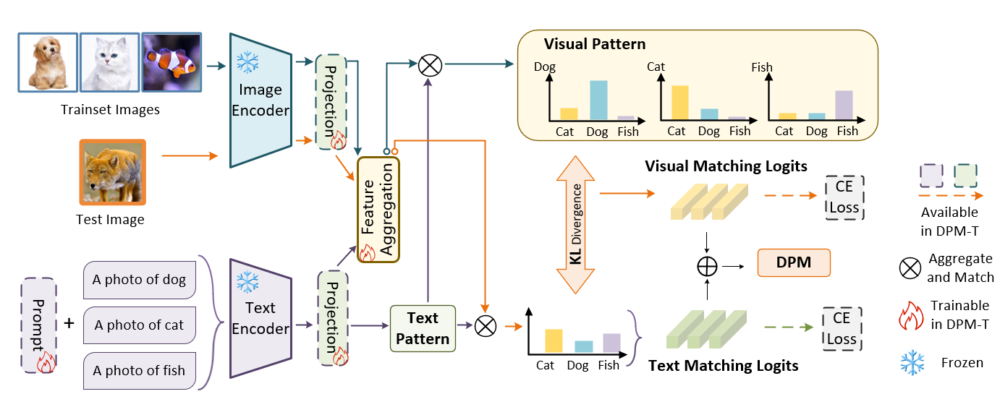

# Vision-Language Dual-Pattern Matching for Out-of-Distribution Detection

The code repository for "Vision-Language Dual-Pattern Matching for Out-of-Distribution Detection" in PyTorch. 

We will gradually improve and enhance the code. 
## News

[09/2024]🎉  Our codes have been released publicly.

[07/2024]🎉  Our paper has been accepted by ECCV2024.

## Abstract

Out-of-distribution (OOD) detection is a significant challenge in deploying pattern recognition and machine learning models, as models often fail on data from novel distributions. Recent vision-language models (VLMs) such as CLIP have shown promise in OOD detection through their generalizable multimodal representations. Existing CLIP-based OOD detection methods only utilize a single modality of in-distribution (ID) information (e.g., textual cues). However, we find that the ID visual information helps to leverage CLIP's full potential for OOD detection. In this paper, we pursue a different approach and explore the regime to leverage both the visual and textual ID information. Specifically, we propose Dual-Pattern Matching (DPM), efficiently adapting CLIP for OOD detection by leveraging both textual and visual ID patterns. 
DPM stores ID class-wise text features as the textual pattern and the aggregated ID visual information as the visual pattern. At test time, the similarity to both patterns is computed to detect OOD inputs. 
We further extend DPM with lightweight adaptation for enhanced OOD detection. 
Experiments demonstrate DPM's advantages, outperforming existing methods on common benchmarks. The dual-pattern approach provides a simple yet effective way to exploit multi-modality for OOD detection with vision-language representations.

## Pipeline
<div align="center">

</div>
<p></p>

<div>
The pipeline of DPM method. The dashed boxes and dashed arrows indicate the module is only available in the DPM-T. For DPM-F, we add a visual matching brand compared with previous methods. Compared with DPM-T, we add lightweight learnable prompts and a linear projection module after the image encoder.
</div>

<p></p>

## Requirements
### Dependencies
Our experiments are conducted with Python 3.9 and Pytorch 2.0.1.
For DPM-T, you need to additionally install [dassl](https://github.com/KaiyangZhou/Dassl.pytorch).
### Datasets
We use [ImageNet-1K](https://image-net.org/index.php) as the ID dataset.
We use OOD datasets, including [iNaturalist](https://arxiv.org/pdf/1707.06642), [SUN](https://vision.princeton.edu/projects/2010/SUN/), [Places](https://arxiv.org/abs/1610.02055), and [Texture](https://arxiv.org/abs/1311.3618), followed by this [repository](https://github.com/deeplearning-wisc/large_scale_ood#out-of-distribution-dataset).
Please put the datasets in the data folder with the following structure:
```

|-- data
    |-- imagenet
        |-- images/
            |--train/ 
            |-- val/
    |-- OOD
        |-- iNaturalist
        |-- SUN
        |-- places365
        |-- dtd
    ...
```
## Run
To run DPM-F, please run the below command:
```
python eval_ood_dpm --in_dataset ImageNet --root-dir ....../data/ --score DPM
```

To run DPM-T, please run the below command:
```
python main.py --root ....../data/ --trainer DPM --output_dir ./output/test/
```
To eval DPM-T, please run the below command:
```
python test.py --root ....../data/ --trainer DPM --output_dir ./output/test/ --load_epoch XX
```
## Acknowledgment
This repo is based on  [MCM](https://github.com/deeplearning-wisc/MCM), [CoOp](https://github.com/KaiyangZhou/CoOp) and [CALIP](https://github.com/ZiyuGuo99/CALIP).

Thanks for their wonderful work!!!
